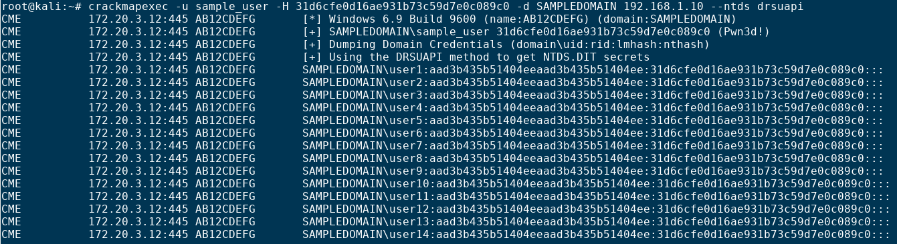

# FLONKERTON

a script to format cracked NTLM hashes as USER:HASH:PASS
only tested with hashcat

## Usage

#### ./flonerkton.sh [-p potfile] -f CME file

## Example

#### ./flonkerton.sh -p pot.pot -f hashes.txt

#### Default POTFILE is located at /usr/share/hashcat/masterpot.pot and will be used if -p flag is not used

## CrackMapExec output that works with this script

# UPDATE

If your crackmap output is like the one shown below, run: [awk '{ print $4 }' $crackmapfile > updated.txt] and use outfile as your infile

